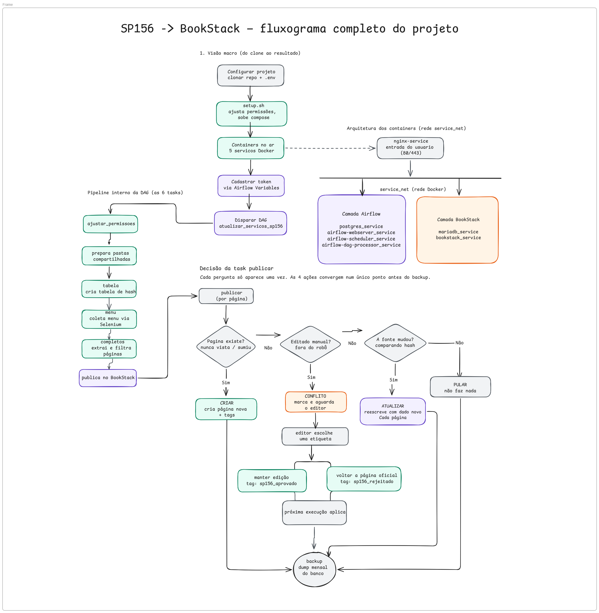

# BookStack

Coleta os serviços e informativos do portal **SP156** (SMSUB/SELIMP) e publica tudo automaticamente em um **BookStack**, orquestrado pelo **Airflow**. Inclui também uma API própria de governança de TIC (FastAPI + Neo4j), independente do pipeline de coleta.


---

## Sumário

- [Pré-requisitos](#pré-requisitos)
- [Como rodar](#como-rodar)
- [Como disparar a DAG](#como-disparar-a-dag)
- [Criar perfil de Editor no BookStack](#criar-perfil-de-editor-no-bookstack)
- [Tags para autorizar ou negar a edição manual](#tags-para-autorizar-ou-negar-a-edição-manual)
- [Estrutura de pastas do Airflow](#estrutura-de-pastas-do-airflow)
- [Configurar as variáveis do BookStack no Airflow](#configurar-as-variáveis-do-bookstack-no-airflow)
- [O que a DAG faz](#o-que-a-dag-faz)
- [API de Governança TIC (FastAPI + Neo4j)](#api-de-governança-tic-fastapi--neo4j)
- [Se algo não subir](#se-algo-não-subir)
- [Erros mais comuns](#erros-mais-comuns)
- [Certificados HTTPS (porta 443)](#certificados-https-porta-443)
- [Resetar o ambiente](#resetar-o-ambiente)
- [Estrutura de pastas do projeto](#estrutura-de-pastas-do-projeto)
- [Guia de lógica do código](#guia-de-lógica-do-código)

---

## Pré-requisitos

| Requisito | Detalhe |
| :--- | :--- |
| **Docker Engine 24+** e **Docker Compose v2** | Confirme com `docker compose version` |
| **Git** | Para clonar e versionar o projeto |
| **RAM disponível recomendada** | ~8 GB. O `airflow-scheduler` reserva até 4 GB, e o Chromium headless (usado pela coleta do menu via Selenium, sequencial) também consome memória |
| **Portas livres no host** | `80`, `443` e `8080` se algo já estiver usando essas portas, o `docker compose up` falha ao tentar publicá-las |

---

## Como rodar

**1. Clone o repositório.**

---

**2. Copie `.env.example` para `.env`** o `setup.sh` também faz isso sozinho, caso você esqueça.

> **Os segredos criptográficos são gerados automaticamente.** 
`AIRFLOW_FERNET_KEY`, `AIRFLOW_SECRET_KEY`, `AIRFLOW_JWT_SECRET`, `BOOKSTACK_APP_KEY` e `MYSQL_ROOT_PASSWORD` vêm vazios no `.env.example` de propósito.
O `setup.sh` preenche cada um sozinho na primeira vez que roda, sem sobrescrever nada que já esteja preenchido. 
Revise apenas os valores "legíveis" que já vêm com exemplo (`POSTGRES_USER`, `MYSQL_USER`, `DB_USERNAME`/`DB_PASSWORD`, `AIRFLOW_ADMIN_USER`/`AIRFLOW_ADMIN_PASSWORD`) se quiser algo diferente do padrão.

> **Precisa resetar um segredo já preenchido** (ex: ambiente novo do zero)? Use `bash setup.sh --regerar-segredos` mas **apenas antes** do primeiro `docker compose up`.
>
> <span style="color:red">⚠️ **Nunca rode `--regerar-segredos` depois que os containers já subiram pela primeira vez.**</span>
>
> O MariaDB só lê o `MYSQL_ROOT_PASSWORD` do `.env` **uma única vez**: na primeira inicialização, quando cria o banco do zero. Depois disso, a senha real fica gravada dentro do volume do banco, não no `.env`.
>
> Se você regerar os segredos depois desse primeiro boot, o `.env` passa a ter uma senha nova mas o banco continua exigindo a senha antiga. Resultado: tudo que tenta conectar no banco usando o `.env` (BookStack, backups) começa a falhar com erro de autenticação, mesmo o banco estando saudável.
>
> **Se isso já aconteceu:** rode `docker compose down -v && ./setup.sh` para recriar o banco do zero com a senha atual do `.env` — lembrando que isso apaga todos os dados (veja [Resetar o ambiente](#resetar-o-ambiente)).

<span style="color:red">⚠️ **Nunca faça commit do `.env` real.** Ele contém senhas e chaves de verdade. O `.gitignore` já bloqueia isso, mas fique atento se copiar arquivos manualmente entre máquinas.</span>

---

---

**3. Suba tudo com o `setup.sh`:**

```bash
./setup.sh
```
>
> Ele ajusta a permissão das pastas compartilhadas com o container **antes** de subir, evitando que o `dag-processor` falhe por não conseguir escrever em `airflow/logs/`. É equivalente a rodar `docker compose up -d --build` na mão, só que com as pastas já preparadas.
>

---

---

**4. Acesse os serviços:**

| Serviço | Endereço | Credenciais |
| :--- | :--- | :--- |
| **Airflow** | http://airflow.localhost | usuário `admin`, senha gerada automaticamente a cada up dos containers: veja como consultar abaixo |
| **BookStack** | http://bookstack.localhost | `admin@admin.com` / `password`|
| **API de Governança TIC** (FastAPI) | http://api.localhost | sem autenticação nesta versão. Documentação interativa (Swagger) em `http://api.localhost/docs` |
| **Neo4j Browser** | http://neo4j.localhost | usuário/senha definidos em `DB_NEO4J_USER`/`DB_NEO4J_PASSWORD` no `.env` |

**Pra ver a senha gerada do Airflow:**

```bash
docker exec airflow-webserver_service cat /opt/airflow/simple_auth_manager_passwords.json.generated
```

---

---

**5.** Cadastre o token de API do BookStack como **Airflow Variable** abaixo segue o passo a passo completo.

## Configurar as variáveis do BookStack no Airflow

O pipeline precisa de um Token de API do BookStack para criar/atualizar páginas via API. Esse token **não fica no `.env`** ele é cadastrado como **Airflow Variable**, o jeito recomendado pelo próprio Airflow de guardar configuração/segredo que a DAG usa em tempo de execução (dá pra trocar sem subir os containers de novo).

| Passo | Ação |
| :--- | :--- |
| **1** | Acesse `http://bookstack.localhost` com o usuário Administrador → **Meu perfil** → crie um **Token de API**. Copie o **Token ID** e o **Token Secret** — <span style="color:red">o Secret só aparece uma vez, na hora da criação</span> |
| **2** | Acesse o painel do Airflow em `http://airflow.localhost` |
| **3** | No menu superior, navegue até **Admin → Variables** |
| **4** | Adicione duas variáveis: `BOOKSTACK_TOKEN_ID` e `BOOKSTACK_TOKEN_SECRET`, colando os valores copiados no passo 1 |

**Alternativa (variável de ambiente do contêiner):**

```python
import os
token_id = os.environ.get('BOOKSTACK_TOKEN_ID')
token_secret = os.environ.get('BOOKSTACK_TOKEN_SECRET')
```

| Quando usar | Vantagem |
| :--- | :--- |
| **Airflow Variable** | Editável pela interface web, sem redeploy ideal pra rotacionar o token sem mexer em arquivo nenhum |
| **Variável de ambiente do contêiner** | Definida no `docker-compose.yml`/`.env`, só muda ao subir containers de novo mais rígida, mas fica versionada junto da infra (exceto o valor do segredo em si) |

---

---

**6.** No Airflow, ative e dispare a DAG `atualizar_servicos_sp156`.

## Como disparar a DAG

1. Acesse `http://airflow.localhost` e faça login (`admin` + a senha gerada veja [Como rodar](#como-rodar)).
2. No menu superior, clique em **DAGs**.
3. Localize `atualizar_servicos_sp156` na lista.
4. Se o botão ao lado do nome estiver cinza/desligado, clique nele para **ativar** a DAG.
5. Clique no ícone de **▶️ (Trigger DAG)**, à direita da linha, e confirme.
6. Acompanhe o progresso clicando no nome da DAG → aba **Grid** ou **Graph**, cada quadrado é uma task (`ajustar_permissoes`, `tabela`, `menu`, `completos`, `publicar`, `backup`).

<span style="color:red">⚠️ **Antes de disparar, confirme que o token do BookStack já está cadastrado** (`Admin → Variables` → `BOOKSTACK_TOKEN_ID`/`BOOKSTACK_TOKEN_SECRET`). Sem isso, a DAG roda até a task `publicar` e falha ali.</span>

---

---

## Criar perfil de Editor no BookStack

**Com o perfil de Administrador:**

1. **Configurações → Perfis** → selecione: *Gerenciar todos os livros, capítulos e permissões de páginas* / *Gerenciar os modelos de página* / *Exportar conteúdo* / *Importar conteúdo*.
2. Em **Permissões de Ativos**, selecione tudo.
3. **Usuários → Adicionar novo usuário** → preencha nome e e-mail → marque a caixa **Editor** → desmarque "enviar por e-mail" e defina uma senha diretamente.
4. Entre com o perfil de Editor criado.

**Para deixar o conteúdo público** (apenas visualização/exportação): **Configurações → Acesso Público**, marque a caixa.

**Para personalizar a aparência do BookStack:** veja o [Guia de Estilo](bookstack/assets/css_bookstack.md).

---

---

## Tags para autorizar ou negar a edição manual

Quando a DAG rodar e aparecer um conflito no Livro de Atualização:

1. Pegue o código do serviço e vá até a página correspondente.
2. Clique em **Editar** → na lateral direita, clique em **Editar** de novo → uma barra lateral vai abrir.
3. Clique no segundo ícone → **Adicionar outro marcador**.
4. Preencha o campo **"Nome do marcador"** com uma das duas opções:

| Marcador | Efeito |
| :--- | :--- |
| `sp156_rejeitado` | Restaura o conteúdo oficial (descarta a edição manual) |
| `sp156_aprovado` | Mantém a edição manual (ignora a fonte oficial) |

<span style="color:red">⚠️ **Só o nome do marcador importa** o campo "Valor do marcador" pode ficar em branco.</span>

---

---

## Estrutura de pastas do Airflow

O projeto separa **o que é DAG** do **que é código auxiliar** uma boa prática comum em projetos Airflow, que evita que o `dag-processor` (o processo que fica escaneando pastas em busca de DAGs) perca performance ou se confunda tentando interpretar arquivos que não são DAGs.

| Pasta | Conteúdo |
| :--- | :--- |
| **`airflow/dags/`** | Exclusivamente arquivos `.py` que definem DAGs (neste projeto, só `atualizar_servicos_sp156.py`). Nada de função auxiliar, script de coleta ou lógica de negócio aqui dentro |
| **`airflow/include/`** | Scripts de ETL e código auxiliar (`coleta.py`, `hash_bookstack.py`, `bookstack_publicacao.py`, `backup_bookstack.py`). É daqui que a DAG importa as funções que ela orquestra |

O **`PYTHONPATH=/opt/airflow`** (configurado no `docker-compose.yml`, dentro do bloco `x-airflow-common`) diz ao Python para procurar módulos a partir da raiz `/opt/airflow`, onde `dags/` e `include/` são montados dentro do container. Por causa disso, a DAG importa assim:

```python
from include.coleta import pegar_menu, completar_dados
from include.bookstack_publicacao import publicar_no_bookstack
from include.hash_bookstack import garantir_tabela
from include.backup_bookstack import fazer_backup
```

> Se criar um novo módulo auxiliar, ele vai em `airflow/include/` e é importado como `from include.seu_modulo import sua_funcao` — não precisa mexer em `PYTHONPATH` nem no `docker-compose.yml`.

---

---

## O que a DAG faz

| Etapa | O que acontece |
| :--- | :--- |
| **1. Ajustar permissões** | Ajusta permissões das pastas compartilhadas (dados/logs usados *durante* a execução) não confundir com o passo de setup do host, que resolve a permissão de `airflow/logs/` antes mesmo do Airflow subir |
| **2. Coletar menu** | Coleta o menu de serviços via Selenium |
| **3. Extrair dados completos** | Abre cada página do menu, uma por vez (sequencial, sem paralelismo, para evitar bloqueio 403), e filtra pelo órgão (SMSUB/SP156/SELIMP) |
| **4. Publicar** | Publica no BookStack (Estante SP156 → Livro por categoria → Capítulo por grupo → Página por serviço), preservando edições manuais via controle de hash |
| **5. Backup** | Faz backup do banco do BookStack (`mariadb-dump`) uma vez por mês, controlando isso numa Airflow Variable, rodar a DAG várias vezes no mesmo mês não repete o dump à toa |

Quer entender a lógica interna de cada etapa, função por função? Veja [Guia de lógica do código](#guia-de-lógica-do-código), logo abaixo.

---

---

## API de Governança TIC (FastAPI + Neo4j)

Além do pipeline SP156 → BookStack, o projeto sobe uma **API própria de governança de TIC**, separada do fluxo de coleta. Ela não é acionada pela DAG — é um serviço independente, pensado pra cadastro manual (ou por integração futura) de contratos, pessoas, sistemas, riscos e o catálogo de serviços de TIC da SMSUB.

| Item | Detalhe |
| :--- | :--- |
| **Onde fica o código** | `fastapi/app/` |
| **Banco de dados** | Neo4j (grafo) não usa MariaDB nem Postgres |
| **Acesso** | http://api.localhost, com Swagger em `http://api.localhost/docs` |
| **Autenticação** | Nenhuma nesta versão  a API está aberta pra quem alcançar `api.localhost` |

### Modelo de dados no Neo4j

Os nós e relações são criados pelos scripts em `neo4j/scripts/`, executados uma vez pelo serviço `neo4j-init` na primeira subida (`init.sh` chama, em ordem: `init_constraints.cypher` → `init_smsub_unidades.cypher` → `init_subprefeituras.cypher` → `inti_pdstic_2026.cypher`).

| Nó | Representa |
| :--- | :--- |
| `OrgaoSetorial` | Órgão da estrutura da SMSUB |
| `Unidade` | Unidade organizacional (identificada por sigla) |
| `Pessoa` | Servidor/colaborador (nome, e-mail, telefones) |
| `ServicoTIC` | Item do catálogo de serviços de TIC (categoria, público-alvo, canal de solicitação, prazo estimado, unidade responsável) |
| `Sistema` | Sistema de informação (nome, sigla) |
| `Contrato` | Contrato de fornecimento (número, ano, fornecedor, vigência, valor anual estimado, processo SEI) |
| `Risco` | Risco associado a contrato/serviço, com categoria (`governanca`, `operacional`, `seguranca`, `dados`, etc.) e origem |
| `BaseDados` | Base de dados vinculada a um sistema |
| `PDSTIC` / `LinhaAcaoPDSTIC` | Plano Diretor de TIC do ano e suas linhas de ação |
| `Indicador` | Indicador de acompanhamento (fórmula, meta, periodicidade, fonte) |

Relações (`Vinculo`) conectam esses nós  por exemplo `PessoaContrato` (`FISCALIZA` / `SUPLENTE_FISCAL` / `GESTOR_CONTRATO`) e `ContratoServico` (`FORNECE` / `FORNECIDO`).

### Rotas disponíveis

Todas sob o prefixo `/v1/governanca`:

| Router | Prefixo | O que expõe |
| :--- | :--- | :--- |
| `servico.py` | `/v1/governanca/catalogo/servicos` | CRUD do catálogo de serviços de TIC, com busca por nome |
| `pessoa.py` | `/v1/governanca/pessoas` | CRUD de pessoas, mais vínculo pessoa↔contrato |
| `contrato.py` | `/v1/governanca/contratos` | CRUD de contratos, mais vínculo contrato↔serviço |
| `risco.py` | `/v1/governanca/risco` | Cadastro e listagem de riscos |

<span style="color:red">⚠️ **`sistema.py` existe (`fastapi/app/routers/sistema.py`, rota `/v1/governanca/sistemas`) mas não está registrado em `main.py`.** O router é importado nos outros arquivos internamente, mas falta a linha `app.include_router(sistema.router, prefix="/v1/governanca")` em `fastapi/app/main.py` — hoje a rota de Sistemas não responde, mesmo com o código pronto.</span>

### Variáveis de ambiente usadas

Vêm do `.env` raiz (não é um `.env` separado dentro de `fastapi/`):

```
DB_NEO4J_URI=bolt://neo4j:7687
DB_NEO4J_USER=neo4j
DB_NEO4J_PASSWORD=<definido no .env>
```

O `fastapi/app/core/config.py` lê essas variáveis via `pydantic-settings`; o `docker-compose.yml` repassa pro container como `NEO4J_URI`/`NEO4J_USER`/`NEO4J_PASSWORD`.

---

---

## Se algo não subir

Primeiro passo, sempre: olhar o log do serviço que falhou.

```bash
# log de um serviço específico, em tempo real
docker compose logs -f <nome-do-serviço>

# status de todos os containers (procure por "unhealthy" ou "Restarting")
docker compose ps
```

---

---

## Erros mais comuns

| Sintoma | Causa provável | O que fazer |
| :--- | :--- | :--- |
| `dag-processor` reinicia sozinho / DAG não aparece na interface | Permissão de pasta | Rode `bash setup.sh` de novo, ele reajusta as permissões antes de subir |
| Airflow sobe mas fica **unhealthy** | Postgres ainda inicializando | Espere ~60s (o `start_period` do healthcheck) antes de considerar que travou de verdade |
| `docker compose up` falha na porta | Porta `80`, `443` ou `8080` já em uso no host | Libere a porta ou pare o outro serviço |
| **502 Bad Gateway** no nginx logo após `--build` | O container de destino (BookStack/Airflow) ainda não terminou de inicializar quando o nginx já começou a aceitar tráfego | Confirme no `docker compose ps` se o serviço já está `(healthy)` se o `nginx-service` estiver com tempo de vida muito maior que os outros, force a recriação: `docker compose up -d --force-recreate nginx` |
| `docker compose logs nginx` não mostra nada, mesmo com erro acontecendo | O `access_log`/`error_log` do nginx está apontando pra um arquivo próprio (`nginx/conf.d/*.conf`), não para a saída padrão do container | Aponte os dois para `/dev/stdout` e `/dev/stderr` no arquivo `.conf` assim voltam a aparecer em `docker compose logs` |
| `bookstack_service` fica **unhealthy** logo após um reset (`down -v`) | Instalação nova roda todas as migrações do banco do zero, o que demora mais que o `start_period` padrão do healthcheck | Aumente o `start_period` do healthcheck do `bookstack_service` (ex: `180s`) para cobrir uma instalação do zero |
| `Proxy Authentication Required` ao rodar `setup.sh` | Rede corporativa/servidor atrás de proxy | Adicione ao `.env`: `HTTP_PROXY`, `HTTPS_PROXY`, `NO_PROXY=localhost,127.0.0.1,.local` e confirme que o `setup.sh` carrega o `.env` com `set -a; source .env; set +a` antes de usar essas variáveis |

---

---

## Certificados HTTPS (porta 443)

O nginx está configurado para escutar em `80` e `443` (`nginx/conf.d/bookstack.conf`), mas os certificados em `nginx/certs/` **não são versionados** (ficam fora do Git por segurança veja `.gitignore`).

<span style="color:red">⚠️ **Para produção com HTTPS real**, gere um certificado (ex: Let's Encrypt) e coloque os arquivos em `nginx/certs/` antes de subir.</span>

---

---

## Resetar o ambiente

```bash
docker compose down -v
./setup.sh
```

<span style="color:red">⚠️ **O `-v` apaga volumes inclusive todo o conteúdo do BookStack (páginas, livros, usuários) e o histórico do Airflow (execuções passadas, Airflow Variables cadastradas, como o token do BookStack).** Depois desse comando, será preciso recadastrar o token do zero.</span>

Se a intenção é só forçar um rebuild limpo **sem perder dados**, use uma versão menos destrutiva:

```bash
docker compose down --rmi local
docker compose up -d --build
```

Isso remove só a imagem construída localmente (`airflow-service:*`), sem mexer nos volumes.

---

---

## Estrutura de pastas do projeto

```
setup.sh              # prepara permissões e sobe o docker compose
airflow/dags/          # exclusivamente definições de DAG (.py)
bookstack/include/      # código de coleta, publicação, hash e backup (ETL) importado pela DAG como include.*
bookstack/dados/        # JSONs gerados em runtime (não versionados)
bookstack/assets/       # fluxograma do projeto e guia de estilo do BookStack
fastapi/app/            # API de Governança TIC (Neo4j) rotas em /v1/governanca/*
neo4j/scripts/          # cypher de inicialização (constraints, unidades, subprefeituras, PDSTIC)
mariadb/init/           # scripts SQL de criação dos bancos na primeira subida
nginx/conf.d/           # proxy reverso na frente de BookStack + Airflow + FastAPI + Neo4j Browser
nginx/certs/            # certificados HTTPS (não versionados, gerar em produção)
docker-compose.yml
Dockerfile
```

> **Nota:** o guia de lógica do código abaixo referencia `airflow/include/` como convenção geral de projetos Airflow (DAG separada de código auxiliar). Neste projeto, a pasta física correspondente é `bookstack/include/` é o caminho real montado no `docker-compose.yml` e de onde a DAG importa (`from include.coleta import ...`).

---

---

## Guia de lógica do código

### 1. `coleta.py`

Busca os dados no site do SP156. Não sabe nada sobre BookStack ou banco, só coleta e salva em JSON. 3 etapas, cada uma com checkpoint próprio (retoma de onde parou, não do zero).

| Função | O que faz | Por quê |
| :--- | :--- | :--- |
| `HEADERS` | Finge ser um navegador real | Sem isso, a proteção anti-bot bloqueia e o pipeline "roda", mas não extrai nada |
| `orgao_e_da_smsub` | Filtra só SMSUB/SELIMP | O site lista várias secretarias |
| `campos_da_pagina` | Extrai "O que é", "Prazo máximo", etc., preservando link e parágrafo (marcadores invisíveis `MARCADOR_LINK_*`/`MARCADOR_PARAGRAFO`) | Lê o texto corrido (não linha a linha) porque o site fragmenta títulos em vários `<span>`; sem os marcadores, `get_text()` apagava todo `<a>`/`<p>` original |
| `pegar_menu` | Navega o menu via Selenium | Serve como checkpoint por categoria |
| `pausa_entre_requisicoes` | Pausa aleatória antes de cada request | Sem isso, workers em paralelo martelam o site e ele bloqueia em massa (caso real: 602/615 páginas bloqueadas) |
| `varrer_ids`  | Testa faixa de IDs 700–7000 em paralelo | Acha páginas "órfãs" que não aparecem no menu; checkpoint por mini-lote de 100. <span style="color:red">**Não é chamada pela DAG atualmente** o código continua no arquivo, mas foi removida do pipeline por gerar bloqueio 403 excessivo</span> |
| `completar_dados` | Extrai conteúdo completo + aplica filtro de órgão, sequencial (sem paralelismo) | Tem trava de segurança: se a maioria das páginas vier "sem conteúdo" ou for tudo bloqueio, falha de propósito em vez de publicar quase vazio (já aconteceu: 1/615 por causa de captcha) |

**Próximo elo da cadeia:** salva `dados_completos.json` é o que `bookstack_publicacao.py` lê pra saber o que publicar.

---

---
### 2. `hash_bookstack.py`

Responde: **"esse conteúdo mudou de verdade desde a última vez?"** Sem isso, toda execução reescreveria tudo, mesmo sem mudança, e apagaria edições manuais feitas direto no BookStack.

| Função | O que faz | Por quê |
| :--- | :--- | :--- |
| `hash_de_conteudo` | Normaliza o texto (tira espaço duplicado/quebra de linha) e gera um SHA-256 | Mesma vírgula a mais → hash igual; conteúdo diferente → hash diferente |
| `_conectar` | Abre conexão nova a cada chamada | Tasks do Airflow rodam em processos separados, conexão de um processo não serve pro outro |
| `decidir_acao` | Função pura (sem I/O). Checa **primeiro** se a página foi editada manualmente no BookStack, independente da fonte ter mudado, e só depois compara com a fonte | Garante que edição manual sempre tenha prioridade sobre mudança na fonte |
| `recalibrar_todas_hash_publicado` | Migração pontual (rodar manualmente, uma vez só, nunca como parte da DAG): recalcula o `hash_publicado` a partir do HTML que o BookStack realmente guarda | Corrige o descompasso causado pelo BookStack reprocessar/reformatar o HTML ao salvar |

**`Decidir_acao` devolve uma das 4 ações abaixo:**

| Ação | Quando acontece |
| :--- | :--- |
| **CRIAR** | Nunca vimos essa página, ou ela "sumiu" do BookStack |
| **PULAR** | Fonte não mudou, a página ainda existe, e ninguém editou por fora |
| **CONFLITO** | Alguém editou a página no BookStack por fora do robô checado independente da fonte ter mudado |
| **ATUALIZAR** | Fonte mudou e ninguém mexeu manualmente |

**Próximo elo da cadeia:** `bookstack_publicacao.py` importa `decidir_acao` ele não decide sozinho, pergunta pra esse arquivo.

---

---

### 3. `bookstack_publicacao.py`

Fala com a API do BookStack. Hierarquia: **Estante → Livro → Capítulo → Página**.

| Função | O que faz | Por quê |
| :--- | :--- | :--- |
| `_obter_ou_criar` | Padrão *get or create*: procura pelo nome, cria só se não achar. Usado pra Estante/Livro/Capítulo | Evita duplicar hierarquia a cada execução |
| `_pagina_compativel_com_tipo` / `_pagina_compativel_com_codigo` | Guarda contra duas páginas com o mesmo nome (ex: "Fazer reclamação" se repete em várias categorias) | Sem isso, a segunda sobrescreveria o conteúdo da primeira silenciosamente |
| `texto_de_campo_para_html` / `_linkificar` | Convertem os marcadores de link/parágrafo vindos de `coleta.py` em `<p>` e `<a>` de verdade | Reconstrói a formatação original perdida na extração |
| `criar_atualizar` | Cria/atualiza a página via API e **busca ela de volta** (GET) logo em seguida | O BookStack reprocessa o HTML ao salvar hashear o que foi enviado nunca bateria com uma leitura futura |
| `_resolucao_de_conflito` | Lê as tags `sp156_aprovado`/`sp156_rejeitado` que um humano coloca manualmente na página | Resolve um conflito sem precisar mexer em código |
| `CONTADOR_POR_STATUS` / `ROTULO_ACAO_EVENTO` | Dicionários de "tradução" (status técnico → nome do contador / texto de exibição) | Centraliza a tradução num lugar só, em vez de espalhar `if status == ...` pelo código |
| `publicar_no_bookstack(arquivo, apenas_um=False)` | Função principal chamada pela DAG. `apenas_um=True` processa só a primeira categoria (uso só em teste, não em produção). Devolve um dicionário-resumo (`paginas_criadas`, `paginas_atualizadas`, etc.) | É esse resumo que aparece no log da task no Airflow |

**Próximo elo da cadeia:** depois de publicar tudo, o pipeline segue pro backup faz sentido fazer isso **depois**, pra capturar o conteúdo mais recente.

---

---

### 4. `backup_bookstack.py`

O mais simples de todos: dump do MariaDB → `.gz` → apaga backups antigos. Sem paralelismo, sem checkpoint (roda 1x por mês).

| Função | O que faz | Por quê |
| :--- | :--- | :--- |
| `_rodar_mariadb_dump` | Se falhar, apaga o `.sql` parcial | Evita backup corrompido disfarçado de válido |
| `_apagar_backups_antigos` | Nome do arquivo tem timestamp, então ordenar por nome já ordena por data. Mantém só os `MANTER_ULTIMOS_PADRAO` (14) mais recentes | Evita acúmulo indefinido de arquivos de backup |
| `fazer_backup` | Junta os dois passos acima e devolve o caminho do arquivo gerado | Ponto de entrada usado pela DAG |

**Próximo elo da cadeia:** não alimenta nenhum outro arquivo. Quem decide *quando* chamar (regra de "1x por mês") é a DAG.

---

---

---
### 5. `atualizar_servicos_sp156.py` a DAG

Não faz trabalho pesado sozinha importa os arquivos acima e define **ordem** e **regras** de quando cada um roda.

| Ponto-chave | Explicação |
| :--- | :--- |
| Tasks não trocam dado em memória | Cada uma escreve num JSON em disco (`PASTA_DADOS`/`ARQ_*`), a próxima lê é assim que `coleta.py` "conversa" com `bookstack_publicacao.py` |
| `_var_int` | Lê uma Airflow Variable (configurável na interface, sem redeploy) como inteiro, com valor padrão |
| `schedule=None` | Não roda sozinha só quando disparada manualmente |
| `max_active_runs=1` | Impede duas execuções ao mesmo tempo (evitaria coletar em duplicidade e causar mais bloqueio) |
| `backup_bookstack_task` | Só chama `fazer_backup()` se o mês mudou desde o último backup salvo numa Airflow Variable é assim que "mensal" é implementado mesmo a DAG rodando várias vezes no mês |
| `ajustar_permissoes >> tabela >> menu >> completos >> publicar >> backup` | O `>>` significa **"depende de"** cada task só começa depois que a anterior termina com sucesso |

---

---

**Fechando o ciclo:**

```
coleta.py → dados_completos.json
          → hash_bookstack.py decide a ação
          → bookstack_publicacao.py publica
          → backup_bookstack.py faz o dump

atualizar_servicos_sp156.py amarra os arquivos acima numa DAG.
```

---